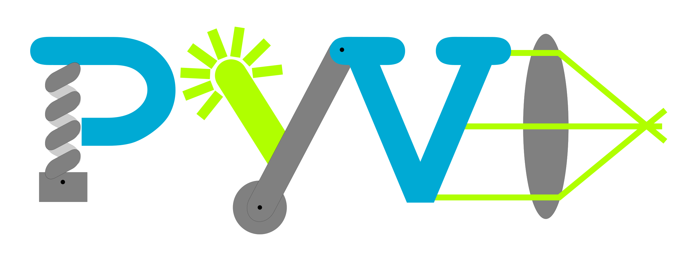

# PyVo

## Was ist PyVo?

*PyVo*, das steht für *Python in der Vorlesung*. 
Es handelt sich hierbei um ein Tutorial zum Lösen von Physikaufgaben mit Hilfe der Programmiersprache Python. Diese Aufgaben kommen aus den Bereichen der Mechanik, Wärmelehre und Optik. Mit diesem Tutorial sollen sowohl Grundlagen der Programmierung in Python und der Datenvisualisierung erlangt werden, als auch demonstriert werden, dass physikalische Problemstellungen außerhalb des universitären oder schulischen Umfelds mittels Programmierkenntnissen gelöst werden können.

 

## Inhaltsverzeichnis: 

- Mechanik:
    - Kinematik
    - Dynamik
    - Impuls
    - Hook'sches Gesetz
- Mechanische Schwingungen und Wellen
- Wärmelehre
- Optik

## Installation

Clone oder lade das PyVo-Repository herunter:

**https://github.com/BoernerLab/PyVo.git**

Innerhalb von Jupyter-Lab oder Jupyter-Notebook kannst du die .ipynb-Dateien öffnen und anschließend den Code kompilieren.