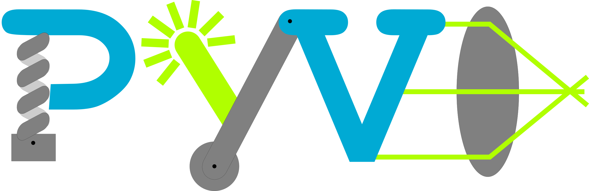

# PyVo

## Was ist PyVo?



*PyVo*, das steht für *Python in der Vorlesung*. 
Es handelt sich hierbei um eine Sammlung von Anleitungen zum Lösen von Physikaufgaben mit Hilfe der Programmiersprache 
Python. Diese Aufgaben kommen aus den Bereichen der Mechanik, Wärmelehre und Optik. Mit diesem Tutorial sollen sowohl 
Grundlagen der Programmierung in Python und der Datenvisualisierung erlangt werden, als auch demonstriert werden, dass 
physikalische Problemstellungen außerhalb des universitären oder schulischen Umfelds mittels Programmierkenntnissen 
gelöst werden können.

<br>

## Installation

Der Code kann unter dem grünen Button "Code" heruntergeladen oder über das Terminal geklont werden.
```
git clone https://github.com/BoernerLab/PyVo.git
```
<br>

Eine Installationsanleitung und Informationen zur Verwendung finden Sie unter [https://boernerlab.github.io/PyVo/](https://boernerlab.github.io/PyVo/).

## Wenn Sie sich beteiligen wollen

*PyVo* wurde von Prof. Richard Börner, Felix Erichson und Lynn Reuss in der Gruppe von Prof. Richard Börner an der Hochschule Mittweida entwickelt und wird momentan von ebendiesen instand gehalten und weiterentwickelt. 

Wenn Sie Fehler und Probleme finden oder Wünsche haben, dann machen Sie uns bitte darauf Aufmerksam über: [GitHubs Issue Tracker](https://github.com/BoernerLab/PyVo/issues/new/choose).

## PyVo zitieren

Wenn Sie *PyVo* verwenden, zitieren Sie *PyVo* bitte folgendermaßen:

Erichson, F., Reuss, L. V., & Börner, R. (2022). PyVo (Version 1.0) [Computer software]

oder

```
@software{Erichson_PyVo_2022,
    author = {Erichson, Felix and Reuss, Lynn V. and Börner, Richard},
    license = {CC-BY-NC-SA-4.0},month = {3},
    title = {{PyVo}},
    version = {1.0},
    year = {2022}}
```

## Lizenz

PyVo ist lizensiert durch die Creative Commons Public Licenses: CC-BY-NC-SA


