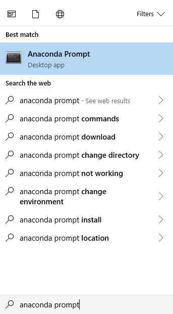
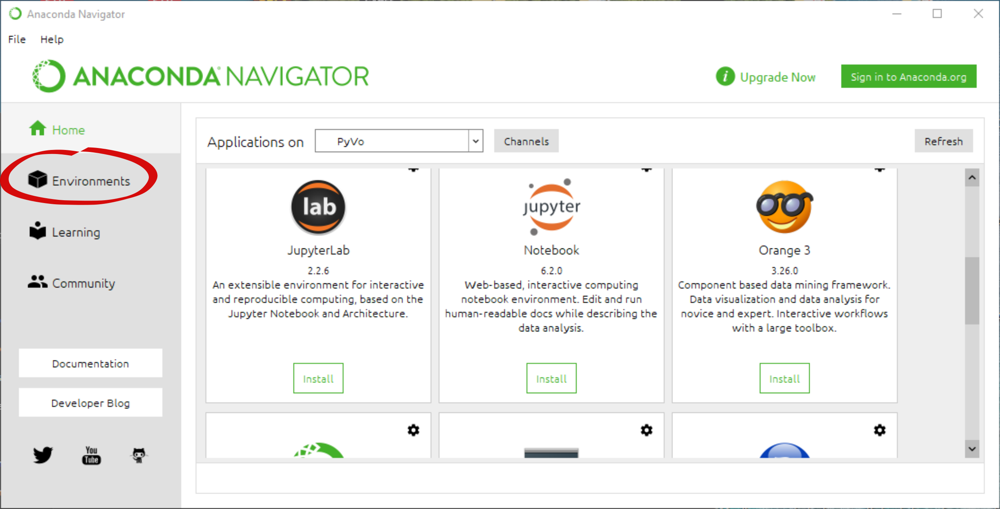
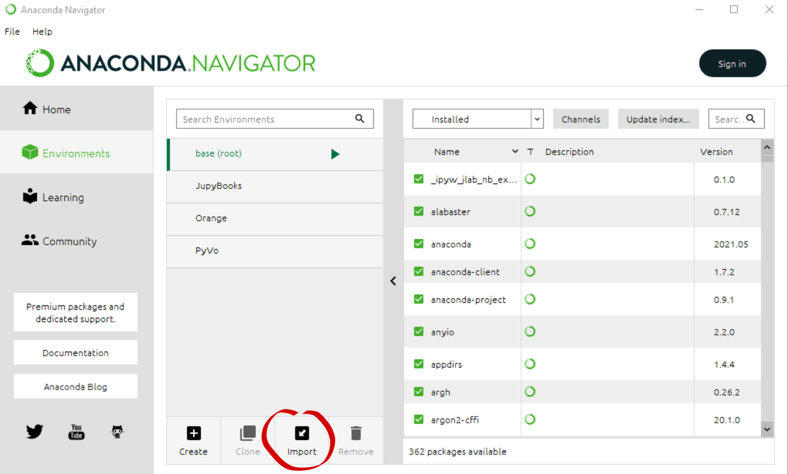
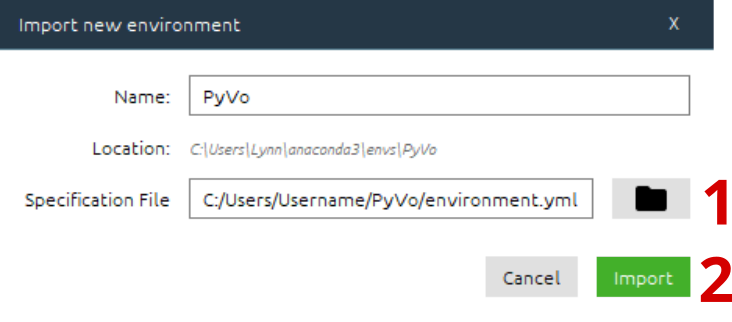
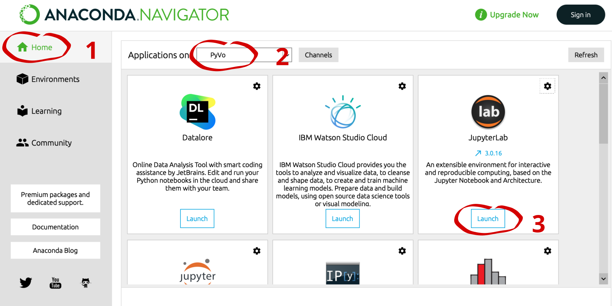

# Installation

Für die Verwendung der PyVo Notebooks aus der Vorlesung bzw. dem Seminar muss der Packetmanager **Anaconda** installiert 
werden. Dieser sorgt dafür, dass alle benötigten Bibliotheken einfach in einem definiertem Ecosystem installiert werden. 

## Anaconda

Anaconda kann auf folgender Webseite heruntergeladen werden:

[https://www.anaconda.com/products/individual](https://www.anaconda.com/products/individual)

Installieren Sie Anaconda nach folgender Anleitung:
- <a href="https://docs.anaconda.com/anaconda/install/windows/" target="_blank">Windows</a>
- <a href="https://docs.anaconda.com/anaconda/install/linux/" target="_blank">Linux</a>
- <a href="https://docs.anaconda.com/anaconda/install/mac-os/" target="_blank">Mac</a>


### PyVo Projekt herunterladen

Laden Sie den Programmcode von PyVo von folgender GitHub Seite herunter bzw. clonen Sie das Repository:
[https://github.com/BoernerLab/PyVo](https://github.com/BoernerLab/PyVo) <br> 

Navigieren Sie anschließend in den heruntergeladenen Ordner, falls Sie mit der Commandozeile arbeiten. 

### Erstellen des PyVo Environment

Für die Vorlesung werden wir ein Environment erstellen, in dem die Aufgaben bearbeitet werden können. Dort werden alle Pakete installiert, die wir verwenden werden.
Das Erstellen des PyVo Environments ist auf verschiedene Arten möglich:

````{tabbed} Windows (Anaconda Navigator)
Vorbereitung: Um die Installation des Environments durch den Import der `environment.yml` Datei zu ermöglichen, muss 
der libmamba-solver installiert werden. Öffnen Sie dafür den Anaconda Prompt über die Suchleiste.<br>

<br/><br/><br/>

Führen Sie nun nacheinander die folgenden Befehle aus: 
```bash
conda update -n base conda

conda install -n base conda-libmamba-solver

conda config --set solver libmamba
```
Hat die Vorbereitung funktioniert, können Sie nun die Installation des Environments starten. Befolgenden Sie dafür die
Schritt für Schritt Anleitung:
<br/><br/><br/>

1. Öffnen Sie den Anaconda Navigator über die Suchleiste. Falls dieser nicht automatisch installiert wurde, installieren 
Sie diesen zusätzlich.
<br/><br/><br/>

2. Navigieren Sie zu den Environments.

<br/><br/><br/>

3. Klicken Sie nun unten auf Import

<br/><br/><br/>

4. Klicken Sie auf **1** und wählen Sie die Datei **environment.yml** aus dem heruntergeladenen PyVo Ordner aus. Mit dem Klick auf **2** wird das Environment angelegt.

<br/><br/><br/>

5. Um nun die Installierten Pakete auch im Jupyter Lab verwenden zu können, öffnen Sie erneut den Anaconda Prompt über die Suchleiste.
<br/><br/><br/>

6. Kopieren Sie anschließend die folgenden Befehle und führen Sie diese mit Enter aus.

```bash
conda activate PyVo
python -m ipykernel install --user --name=PyVo
```
<br/><br/><br/>
7. Navigieren Sie nun auf Home (**1**) und wählen Sie unter **2** PyVo aus. Dadurch wird das Environment aktiviert.
Im Anschluss können Sie JupyterLab unter **3** öffnen. Dabei öffnet sich Ihr Browser.

````

````{tabbed} Windows (Anaconda Prompt)
Öffnen Sie das Anaconda Prompt über die Suchleiste und navigieren Sie zum PyVo Ordner<br>
Hinweis: Sie können die Ordner wechseln mit dem Befehl **cd**. Beispiel: `cd \User\Name\Desktop\PyVo`

Um eine reibungslose und schnelle Installation zu ermöglichen, wird zuerst der libmamba-solver installiert. Dafür führen Sie 
nacheinander die folgenden Befehle aus: 

```bash
conda update -n base conda

conda install -n base conda-libmamba-solver

conda config --set solver libmamba
```

Danach kann das PyVo Environment mit folgendem Befehl erstellt werden.

```bash
conda env create -f environment.yml
```

Aktivieren Sie im Anschluss das Environment und setzen Sie ihr Environment als Jupyter Kernel mit:
```bash
conda activate PyVo
python -m ipykernel install --user --name=PyVo
```

Tippen Sie nun den Befehl `jupyter-lab` in das Terminal um Jupyter-Lab zu öffnen.
````

````{tabbed} Linux / Mac
Öffnen Sie das Terminal und navigieren Sie zum PyVo Ordner.<br>
Hinweis: Sie können die Ordner wechseln mit dem Befehl **cd**. Beispiel: `cd \User\Name\Desktop\PyVo`

Um eine reibungslose und schnelle Installation zu ermöglichen, wird zuerst der libmamba-solver installiert. Dafür führen Sie 
nacheinander die folgenden Befehle aus: 

```bash
conda update -n base conda

conda install -n base conda-libmamba-solver

conda config --set solver libmamba
```

Danach kann das PyVo Environment mit folgendem Befehl erstellt werden:

```bash
conda env create -f environment.yml
```

Aktivieren Sie im Anschluss das Environment und setzen Sie ihr Environment als Jupyter Kernel mit:
```bash
conda activate PyVo
python -m ipykernel install --user --name=PyVo
```

Tippen Sie nun den Befehl `jupyter-lab` in das Terminal um Jupyter-Lab zu öffnen.

````
<br/><br/><br/><br/>
